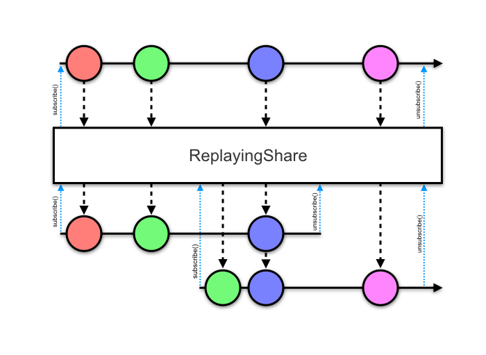

RxJava Replaying Share
======================

`ReplayingShare` is an RxJava 2 transformer which combines `replay(1)`, `publish()`, and
`refCount()` operators.

Unlike traditional combinations of these operators, `ReplayingShare` caches the last emitted
value from the upstream observable or flowable *only* when one or more downstream subscribers are
connected. This allows expensive upstream sources to be shut down when no one is listening while
also replaying the last value seen by *any* subscriber to new ones.



Apply with `compose` to an upstream `Observable` or `Flowable` and cache the resulting instance for
all new subscribers.

```java
@Singleton class Chart {
  private final Observable<Bitmap> chart;

  @Inject Chart(Observable<List<Data>> data) {
    chart = data.debounce(1, SECONDS)
        .map(list -> bigExpensiveRenderChartToBitmapFunction(list))
        .compose(ReplayingShare.instance());
  }

  Observable<Bitmap> data() {
    return chart;
  }
}
```

Note: This operator is designed for composition with infinite or extremely long-lived streams. Any
terminal event will clear the cached value.


Download
--------

Maven:
```xml
<dependency>
  <groupId>com.jakewharton.rx2</groupId>
  <artifactId>replaying-share</artifactId>
  <version>2.1.1</version>
</dependency>
```
Gradle:
```groovy
compile 'com.jakewharton.rx2:replaying-share:2.1.1'
```

If you use Kotlin, a package with an extension method for both `Observable` and `Flowable` is
provided. Replace the `replaying-share` artifact ID above with `replaying-share-kotlin`.

Snapshots of the development version are available in [Sonatype's `snapshots` repository][snap].


License
-------

    Copyright 2016 Jake Wharton

    Licensed under the Apache License, Version 2.0 (the "License");
    you may not use this file except in compliance with the License.
    You may obtain a copy of the License at

       http://www.apache.org/licenses/LICENSE-2.0

    Unless required by applicable law or agreed to in writing, software
    distributed under the License is distributed on an "AS IS" BASIS,
    WITHOUT WARRANTIES OR CONDITIONS OF ANY KIND, either express or implied.
    See the License for the specific language governing permissions and
    limitations under the License.


 [snap]: https://oss.sonatype.org/content/repositories/snapshots/
